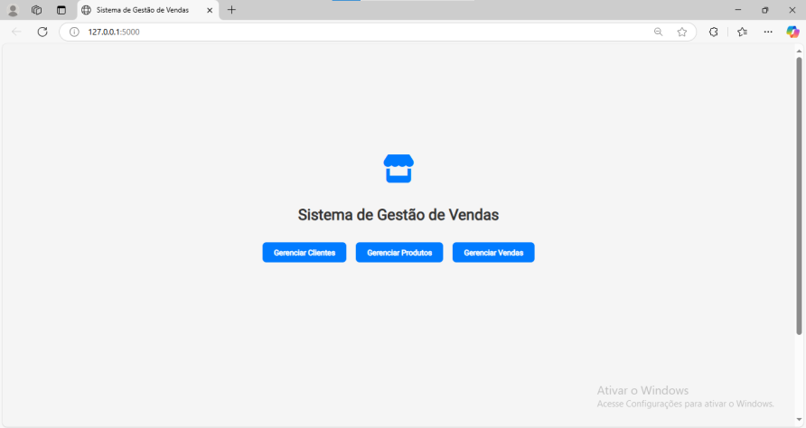
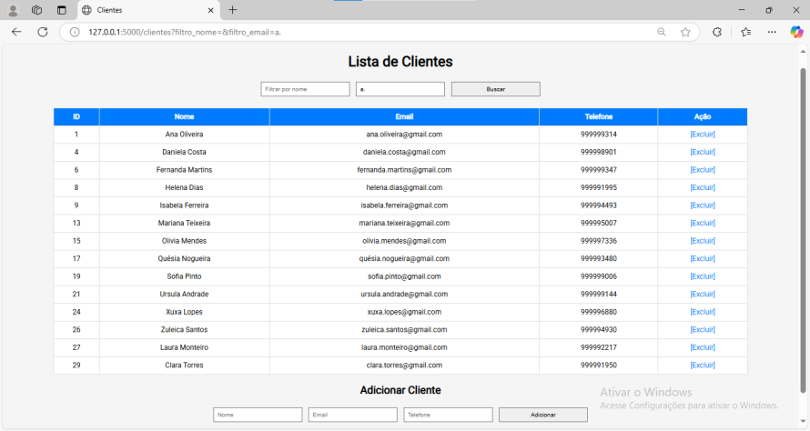
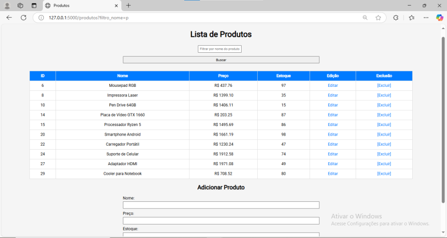
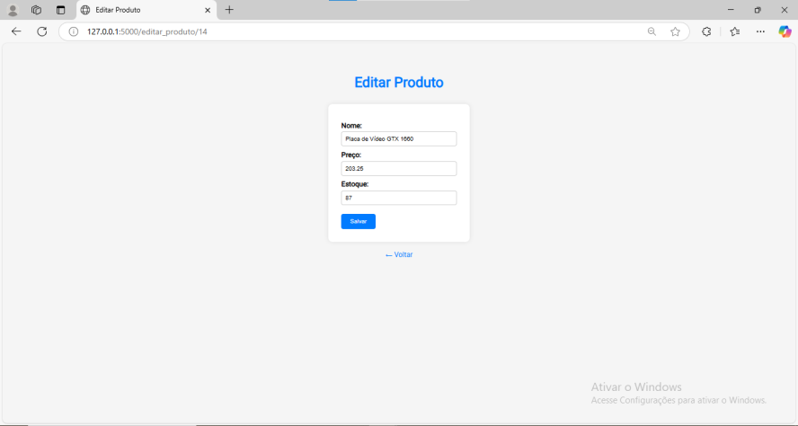
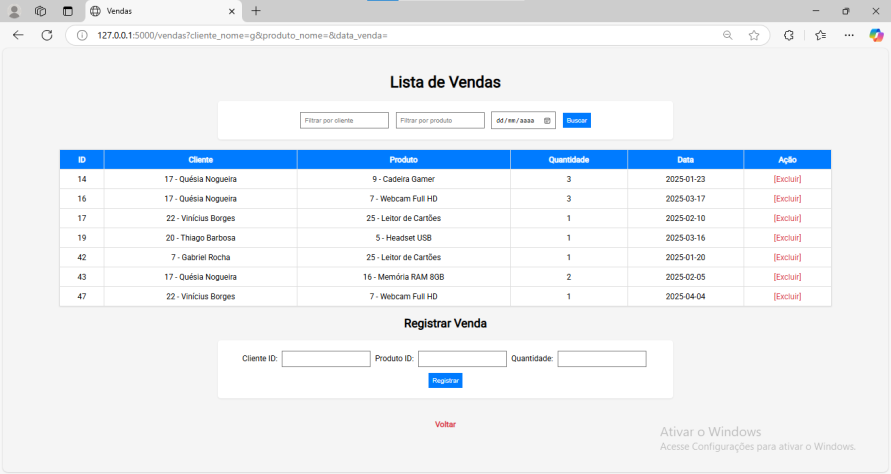
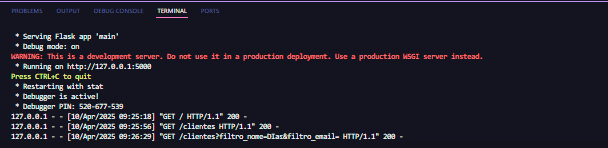

 # 🛒 Sistema Básico de Gestão de Vendas

 Este projeto tem como objetivo desenvolver um sistema simples de gestão de vendas com interface web. A proposta é criar uma aplicação acessível, mesmo para pessoas com pouca familiaridade com computadores, sendo ideal para pequenos comércios como mercadinhos e lojas locais.
 A aplicação foi desenvolvida utilizando Python, com as bibliotecas Flask (para a criação da interface web) e SQLAlchemy (para a manipulação do banco de dados relacional).

 ## 🗃️ Estrutura das Tabelas
 
 As tabelas do sistema são representadas por classes Python utilizando SQLAlchemy. Sendo elas:

 ### 🧑‍💼 `Cliente`

• `id:` Chave primária, autoincrementada  
• `nome:` Nome do cliente  
• `email:` E-mail do cliente  
• `telefone:` Telefone para contato  

### 📦 `Produto`

• `id:` Chave primária, autoincrementada  
• `nome:` Nome do produto  
• `preco:` Preço unitário (em reais)  
• `estoque:` Quantidade em estoque (atualizada dinamicamente conforme as vendas)  

### 💸 `Venda`

• `id:` Chave primária, autoincrementada  
• `cliente_id:` Chave estrangeira referenciando a tabela de clientes  
• `produto_id:` Chave estrangeira referenciando a tabela de produtos  
• `data_venda:` Data e hora da venda (inserida automaticamente)  
• `quantidade:` Quantidade de produtos vendidos  

## ✅ Funcionalidades Implementadas

**Gerenciamento de Clientes:**

• Adicionar novos clientes  
• Listar clientes em formato de tabela  
• Busca filtrada de clientes pelo nome e pelo email 
• Excluir clientes  

**Gerenciamento de Produtos:**

• Adicionar novos produtos
• Lista informações de produtos em formato de tabela 
• Atualizar informações como preço e estoque  
• Busca filtrada de produtos pelo nome 
• Excluir produtos  

**Registro de Vendas:**

• Registrar uma nova venda (com data automática)  
• Lista informações de vendas em formato de tabela
• Subtrair automaticamente a quantidade vendida do estoque  
• Busca filtrada de vendas por cliente, produto e data  
• Excluir vendas  

## 🧩 Bibliotecas Utilizadas

◆ **Flask** - Responsável por fornecer os recursos para criação da interface web e rotas.  
◆ **SQLAlchemy** - ORM que facilita a criação e manipulação de bancos de dados com Python.  
◆ **datetime** - (biblioteca padrão): Para o registro automático da data e hora das vendas.  

## 🖼️ Capturas de Tela

  